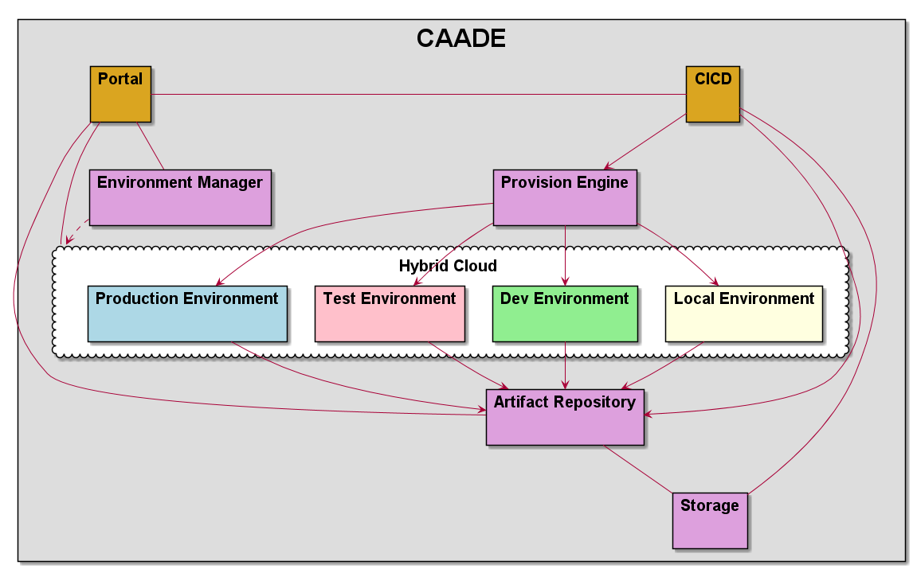

# CAADE
CAADE (Cloud Aware Application Development Environment) is a reference architecture that discribes how
developers and devops work together in a hybrid cloud to enable the development of cloud aware applications.
The architecture contains use cases, actors, solutions and implementation details for
this architecture.

This repository contains the design and a simple interactive reference architecture of the design.
Which can be found on the [Read the Docs](http://caade.readthedocs.io) document hub.



## Design

The design uses [plantuml](http://plantuml.com/) and [rst](http://www.sphinx-doc.org/en/master/usage/restructuredtext/basics.html)
to document the architecture.

Plantuml is a text based language that lets you describe UML diagrams. 
All of the plantuml graphic files are shown in the *.md (markdown language files). 
In order to see the graphical representation of the uml files you have to generate *.png files.
To generate the graphic files (*.png) for the plantuml files (*.puml) do the following:

```
# npm run-script design
```

## Implementations

An implementation of the reference architecture is written using [sailsjs](http://sailsjs.org/) a nodejs MVC framework.
