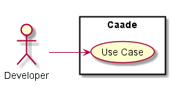
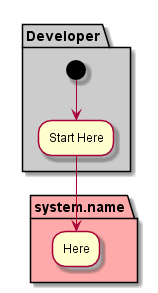
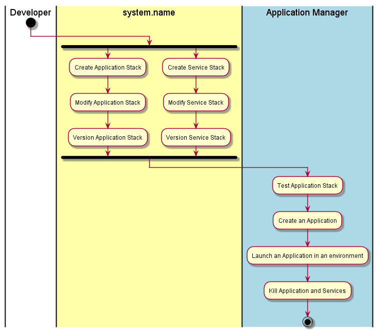

Developer
=========

'Actor-DevOps'_ is another actor.
:ref:`Actor-DevOps' is another actor.

Use Cases
---------
* _UseCases_

Activities
----------
_description_

Workflow
--------
_description_

User Interface
--------------
TBD

Command Line Interface
----------------------

TBD
