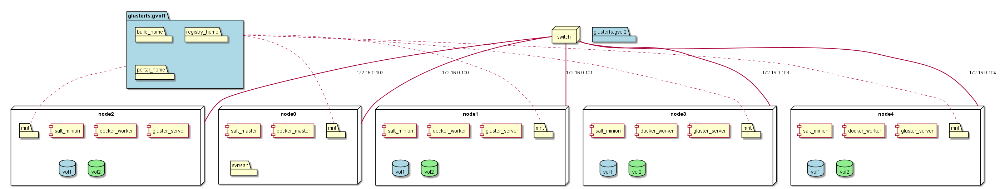

======================
Architectural Overview
======================
CAADE (Cloud Aware Application Development Environment) is a reference architecture that discribes how
developers and devops work together in a hybrid cloud to enable the development of cloud aware applications.

Users
-----

* :ref:`Actor-Developer`
* :ref:`Actor-DevOps`

High level Use Cases
--------------------

* :ref:`UseCase-Manage-Application`
* :ref:`UseCase-Manage-Build`
* :ref:`UseCase-Manage-Code`
* :ref:`UseCase-Manage-Environment`
* :ref:`UseCase-Manage-Pipeline`
* :ref:`UseCase-Manage-Project`
* :ref:`UseCase-Manage-Service`

.. image:: UseCases/UseCases.png

Logical Architecture
--------------------

Developers need to focus on the developement of applications. When code is modified and checked into
a code repository like github. A CI/CD system will automatically build, test and deploy the application,
microservice or project. Multiple environments that have been created in the Common Cloud Core will
be used by CAADE and the CI/CD to promote applications across the different environments.

* :ref:`SubSystem-Automation-Framework`
* :ref:`SubSystem-CICD`
* :ref:`SubSystem-Hybrid-Cloud`
* :ref:`SubSystem-Hybrid-Cloud/Artifact-Repository`
* :ref:`SubSystem-Hybrid-Cloud/Environment-Manager`
* :ref:`SubSystem-Hybrid-Cloud/Provision-Engine`
* :ref:`SubSystem-Hybrid-Cloud/Storage`
* :ref:`SubSystem-SCM`

.. image:: Architecture.png

Process Architecture
--------------------

This diagram shows how a developer interacts with CAADE to develop, test, and deploy 
cloud aware applications.

.. image:: Solution/Process.png

Deployment model
----------------

CAADE is made up a of a set of services and microservices to deliver capabilities to the :ref:'Actor-Developer'.
The Service architecture shown in the deployment model is an example of an implementation of a
CAADE architecture.

.. image:: Solution/Deployment.png

Physical Architecture
---------------------

The physical architecture of CAADE is an example of a minimal hardware configuration that
CAADE can be deployed.

