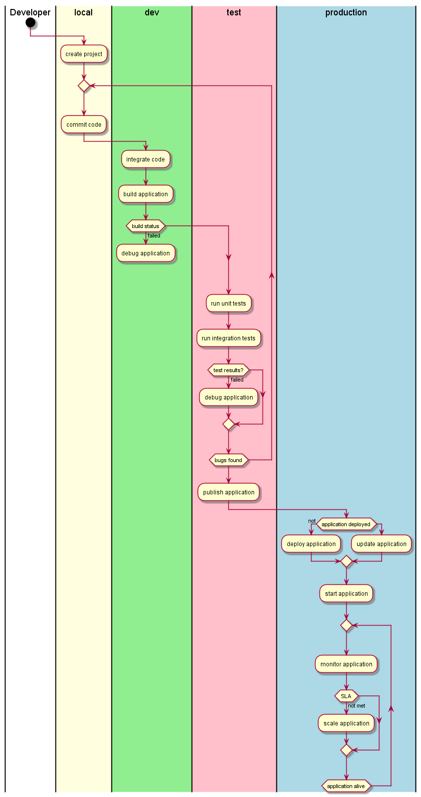

# Architectural Overview

_Description_

## [Users](Actors)

 * [Developer](Actor-Developer)

## High level Use Cases

 * [Create Application](UseCase-Create-Application)
 * [Create MicroService](UseCase-Create-MicroService)
 * [Create Project](UseCase-Create-Project)
 * [Debug Application](UseCase-Debug-Application)
 * [Debug MicroService](UseCase-Debug-MicroService)
 * [Deploy Application](UseCase-Deploy-Application)
 * [Deploy MicroService](UseCase-Deploy-MicroService)
 * [Modify Code](UseCase-Modify-Code)
 * [Publish Application](UseCase-Publish-Application)
 * [Publish MicroService](UseCase-Publish-MicroService)
 * [Test Application](UseCase-Test-Application)
 * [Test MicroService](UseCase-Test-MicroService)

## Logical Architecture

Developers need to focus on the developement of applications. When code is modified and checked into
a code repository like github. A CI/CD system will automatically build, test and deploy the application,
microservice or project. Multiple environments that have been created in the Common Cloud Core will
be used by CAADE and the CI/CD to promote applications across the different environments.

* [Common Cloud Core](https://github.com/CAADE/C3/wiki) - External
* [CI/CD](SubSystem-CICD)
* [DevCloud](SubSystem-DevCloud)
* [LocalCloud](SubSystem-LocalCloud)
* [ProductionCloud](SubSystem-ProductionCloud)
* [Registry](SubSystem-Registry)
* [SCM](SubSystem-SCM)
* [Test Cloud](SubSystem-TestCloud)

## Process Architecture
This diagram shows how a developer interacts with CAADE to develop, test, and deploy 
cloud aware applications.

## Deployment model

CAADE is made up a of a set of services and microservices to deliver capabilities to the Developer.
The Service architect shown in the deployment model is an example of an implementation of a
CAADE architecture.

## Physical Architecture

The physical architecture of CAADE is an example of a minimal hardware configuration that
CAADE can be deployed.

