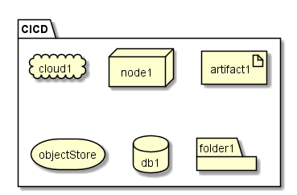

.. _SubSystem-CICD:

CICD
====

CICD is a subsystem of caade that is implemented by an existing CI/CD service that is available
today. Examples of CICD systems that can be used are Jenkins, Bamboo, TravisCI, etc...

Use Cases
---------
* :ref:`Scenario-Test-Application`

Users
-----
* :ref:`Actor-Developer`

Uses
----

* :ref:`SubSystem-CICD`

Interface
---------

* CLI - Command Line Interface
* REST-API 
* Portal - Web Portal

Logical Artifacts
-----------------

* Agent - Agent running in the different clouds that perform builds for a Project
* Build - Build Stages of a pipeline for a project.
* Pipeline - Pipeline that defineds how a project is built, test, and deployed
* Project - Project that contains the application and microservices
* Stage - Stage of builds defined in the pipeline.

.. image:: Logical.png

Activities and Flows
--------------------

Deployment Architecture
-----------------------

Physical Architecture
---------------------

