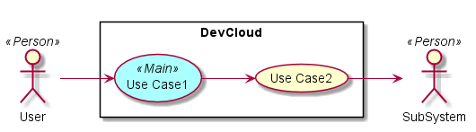
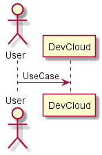
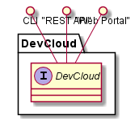
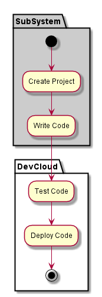
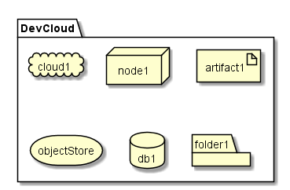
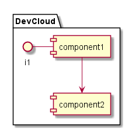

.. _SubSystem-DevCloud:

DevCloud
========
DevCloud is a subsystem of caade ...

Use Cases
---------
*

Users
-----
*

Uses
----

* :ref:`SubSystem-DevCloud`
* 

Interface
---------

* CLI - Command Line Interface
* REST-API - 
* Portal - Web Portal

Logical Artifacts
-----------------
*

Activities and Flows
--------------------

Deployment Architecture
-----------------------

Physical Architecture
---------------------

