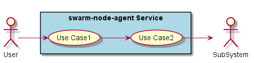
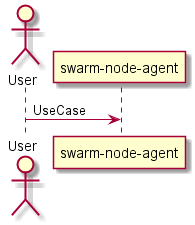
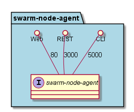
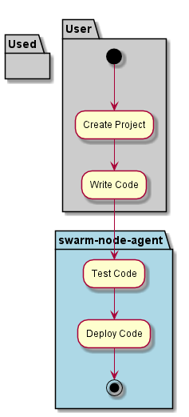
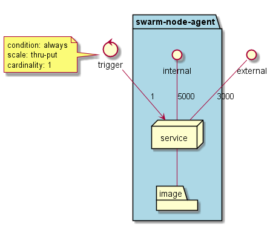
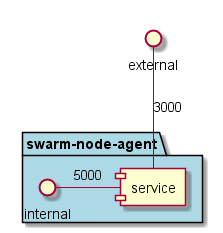

.. _Service-swarm-node-agent:

swarm-node-agent
================

swarm-node-agent is a micro-service of caade ...

Use Cases
---------

*

Users
-----

* :ref:`Actor-DevOps`

Uses
----

* :ref:`Service-swarm-node-agent`

Interface
---------

* CLI - Command Line Interface
* REST-API -
* Portal - Web Portal

Logical Artifacts
-----------------

*

Activities and Flows
--------------------

Deployment Architecture
-----------------------

This is the deployment of the micro-service.
The micro-service is deployed when *trigger* and should scale from *# to #* based on *condition*.
The micro-service is deployed with the *imagename* image.
The ports exposed are 5000 for external and 3000 for internal.

Physical Architecture
---------------------

The micro-services are physically deployed on to a hybrid cloud infrastructure.

