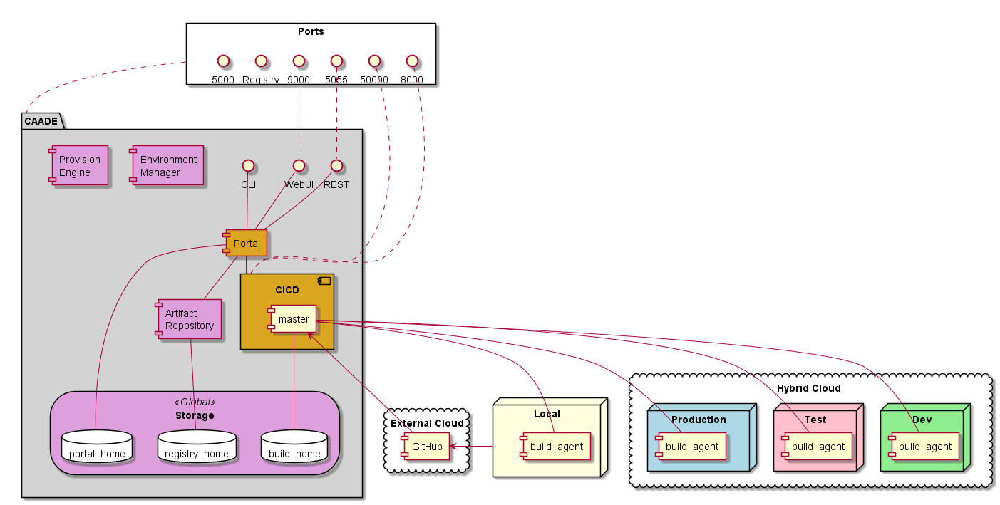

.. _Solution-Docker-Solution:

CAADE Docker Solution
=====================

This solution is a Docker solution of the CAADE Architecture.
It utilizes Docker Swarm, Jenkins, Salt Stack and GlusterFS. It is a simple
example of the concepts of the CAADE architecture running on a small scale.

Actors
------

* :ref:`Actor-Developer`
* :ref:`Actor-DevOps`

High level Use Cases
--------------------

* :ref:`UseCase-Manage-Application`
* :ref:`UseCase-Manage-Build`
* :ref:`UseCase-Manage-Code`
* :ref:`UseCase-Manage-Environment`
* :ref:`UseCase-Manage-Pipeline`
* :ref:`UseCase-Manage-Project`
* :ref:`UseCase-Manage-Service`

.. image:: ../UseCases/UseCases.png

Logical Architecture
--------------------

:ref:`Actor-Developer` need to focus on the development of applications. When code is modified and checked into
a code repository like github. A :ref:`SubSystem-CICD` system will automatically build, test and deploy the application,
microservice or project. Multiple environments that have been created in the Common Cloud Core will
be used by CAADE and the :ref:`SubSystem-CICD` to promote applications across the different environments.

.. image:: ../Architecture.png

Process Architecture
--------------------

This diagram shows how a developer interacts with CAADE to develop, test, and deploy 
cloud aware applications.

.. image:: Process.png

Deployment model
----------------

CAADE is made up a of a set of services and micro-services to deliver capabilities to the :ref:`Actor-Developer`.
The Service architect shown in the deployment model is an example of an implementation of a
CAADE architecture.

Physical Architecture
---------------------

The physical architecture of CAADE is an example of a minimal hardware configuration that
CAADE can be deployed.

.. image:: Physical.png

Deployment
----------

This is a Reference Architecture for the CAADE solution using Salt, Docker, Jenkins, and Gluster.

Salt Stack
~~~~~~~~~~

**Install Salt Master on Node 0**

.. code-block:: none

    node0# sudo apt-get install salt-api
    node0# sudo apt-get install salt-master
    node0# sudo apt-get install salt-minion

Now that you have salt installed on node0 (master node).
Go to the master configuration file /etc/salt/master and add these lines.

.. code-block:: none

    file_roots:
       base:
         - /srv/salt/
    pillar_roots:
      base:
        - /srv/pillar

There should be several things that are in the /etc/salt/master file commented out.

Get the fingerprint of the master node

.. code-block:: none

    node0# sudo salt-key -f master.pub

Save this string it will be used in the configuration of the minions.

**Install Salt Minion on Node[0-4]**

.. code-block:: none

    node1# sudo apt-get install salt-minion

Now edit the /etc/salt/minion file to contain the following

.. code-block:: none

    master: node0
    master_finger: "Put output of 'alt-key -f master.pub' here"

Get things running
~~~~~~~~~~~~~~~~~~
On node0 start the salt master as root in the foreground

.. code-block:: none

    node0# sudo salt-master

or in the background

.. code-block:: none

    node0# sudo salt-master -d

On node[0-4] start the salt-minions

.. code-block:: none

    node1# sudo salt-minion

or in the background with the -d flag

.. code-block:: none

    node1# sudo salt-minion -d

now go back to node0 and accept the minions into the salt stack

.. code-block:: none

    node0# sudo salt-key -A

Now you can test and see if salt can see all of the nodes

.. code-block:: none

    node0# salt "*" test.ping
    node0:
        True
    node1:
        True
    node2:
        True
    node3:
        True
    node4:
        True

1. Configure Salt states 
2. Configure Salt Pillar
3. Download Salt Formula for CAADE

Install Gluster
~~~~~~~~~~~~~~~

**Install Gluster on each of the nodes (node[0-4])**

.. code-block:: none

    node0# sudo apt-get update

**Install GlusterFS package using the following command**

.. code-block:: none

    node0# sudo apt-get install -y glusterfs-server

Start the glusterfs-server service on all gluster nodes.

.. code-block:: none

    node0# sudo service glusterfs-server start

Create Volumes for Gluster to use
This assumes that you already have drives that have been mounted.

.. code-block:: none

    sudo mkdir -p /data/gluster
    sudo mount /dev/sdb1 /data/gluster

Add an entry to /etc/fstab for keeping the mount persistent across reboot.

.. code-block:: none

    echo "/dev/sdb1 /data/gluster ext4 defaults 0 0" | sudo tee --append /etc/fstab

Now attach all of the nodes to each other. Go to node0 and type the following.

.. code-block:: none

    node0# sudo gluster peer probe node1
    node0# sudo gluster peer probe node2
    node0# sudo gluster peer probe node3
    node0# sudo gluster peer probe node4

Now you can add volumes to the gluster cluster

.. code-block:: none

    node0# salt "*" cmd.run "mkdir -d /data/gluster/gvol0"
    node0# sudo gluster volume create gvol0 replica 2 node1:/data/gluster/gvol0 node2:/data/gluster/gvol0
    node0# sudo gluster volume start gvol0
    node0# sudo gluster volume info gvol0

Mount Gluster Volumes on all of the nodes
~~~~~~~~~~~~~~~~~~~~~~~~~~~~~~~~~~~~~~~~~

Now you have created a volume and now you can access it on all of the nodes by mounting it.

.. code-block:: none

    node0# mkdir /mnt/glusterfs
    node0# mount -t glusterfs node1:/gvol0 /mnt/glusterfs

To make the mount permanent across reboots you need to add it to the fstab

.. code-block:: none

    node0# echo "node1:/gvol0 /mnt/glusterfs glusterfs  defaults,_netdev 0 0" | echo tee --append /etc/fstab

Additional information can be found [here](http://www.itzgeek.com/how-tos/linux/ubuntu-how-tos/install-and-configure-glusterfs-on-ubuntu-16-04-debian-8.html)

Docker Swarm
------------
There is a great blog on how to generically set this up [here](http://btmiller.com/2016/11/27/docker-swarm-1.12-cluster-orchestration-with-saltstack.html).

1. Using Salt Stack install 
2. Test Docker Swarm Installation

Jenkins Configuration
---------------------

Install the following plugins
1. Self-Organizing Swarm Plug-in Modules

Registry Configuration
----------------------

An RSA keey is needed for the local Docker Registry. This can be done with OpenSSL.
The docker-compose.yaml file for the deployment of CAADE stores in volumes that are monunted
into the containter. The domain.key and domain.cert files should be accessible.

**Generating the openssl certs.**

So we need to generate the key and cert in a ./registry_certs directory in the same path of where you run the stack
deploy command. so you will need to create a directory named registry_certs and then run the openssl command.

.. code-block:: none

    # mkdir registry_certs
    # openssl req -newkey rsa:4096 -nodes -sha256 -keyout registry_certs/domain.key \
     -x509 -days 356 -out registry_certs/domain.cert
    Generating a 4096 bit RSA private key
    .......................++
    ...............................................................................................................................................++
    writing new private key to 'registry_certs/domain.key'
    -----
    You are about to be asked to enter information that will be incorporated
    into your certificate request.
    What you are about to enter is what is called a Distinguished Name or a DN.
    There are quite a few fields but you can leave some blank
    For some fields there will be a default value,
    If you enter '.', the field will be left blank.
    -----
    Country Name (2 letter code) [AU]:US
    State or Province Name (full name) [Some-State]: CA
    Locality Name (eg, city) []:
    Organization Name (eg, company) [Internet Widgits Pty Ltd]:
    Organizational Unit Name (eg, section) []:
    Common Name (e.g. server FQDN or YOUR name) []: <registry server>
    Email Address []:

Now that the keys are created and put into a directory that the docker compose file references and put into the secrets
docker will now know where to find the keys and certs to launch a secure private repository. Make sure that you access
the registry through the same name specified in the key generation <registry server>. Ideally this would be a common name
that all clients can access through exposure of the ports through the docker stack deploy. Such as the docker swarm node
machine.

Putting the certs in each Client
~~~~~~~~~~~~~~~~~~~~~~~~~~~~~~~~

Using the CAADE configuration we put the domain.cert in the /etc/docker/certs.d directory.
Specifically we need to put the domain.cert into the /etc/docker/certs.d/<registry_address>/ca.cert.
In order to do this simply we need to put the domain.cert in a mounted filesystem and using salt to update docker client.
This will make it so every node in the docker swarm can access the local private repository.

.. code-block:: none

    cp -r ./registry-certs /mnt/registry/registry-certs
    salt "*" cmd.run "mkdir -p /etc/docker/certs.d/node0:5000"
    salt "*" cmd.run "cp /mnt/registry/registry-certs/domain.cert /etc/docker/certs.d/node0:5000/ca.crt"
    salt "*" cmd.run "service docker restart"

Deploying the stack of services
-------------------------------

Now that the environment is set up. You can now deploy the stack to your cluster of machines. You will need to:

1. Get the latest release from github.
2. Copy the registry_certs to the deploy directory. For the local private Registry.
3. Deploy the stack to docker.

.. code-block:: none

    # git clone http://github.com/CAADE/CAADE
    # cd deploy
    # cp -r <registry_certs> ./registry_certs
    # docker stack deploy --compose-file production/docker-compose.yaml caade

