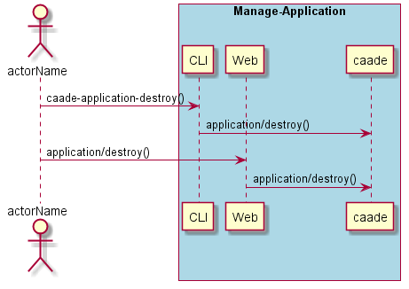
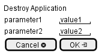

.. _Scenario-Destroy-Application:

Destroy Application
===================

Destroy Application using CLI and Web Interface with ... <parameters>

**CLI**

This is the command line interface for the Destroy Application Scenario.

.. code-block:: none

  # caade application destroy <parameters>
  # caade application destroy exmaple

**Web Interface**

This is a mock up of the Web Interface for the Destroy Application Scenario.

**REST**

This is the RESTful interface for the scenario.

*application/destroy*

============  ========  ===================
Name          Value     Description
------------  --------  -------------------
parameter1    value1    Description1
============  ========  ===================
