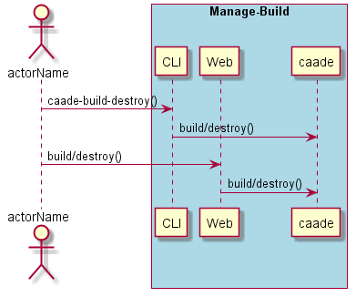
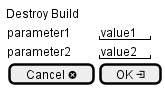

.. _Scenario-Destroy-Build:

Destroy Build
=============

Destroy Build using CLI and Web Interface with ... <parameters>

**CLI**

This is the command line interface for the Destroy Build Scenario.

.. code-block:: none

  # caade build destroy <parameters>
  # caade build destroy exmaple

**Web Interface**

This is a mock up of the Web Interface for the Destroy Build Scenario.

**REST**

This is the RESTful interface for the scenario.

*build/destroy*

============  ========  ===================
Name          Value     Description
------------  --------  -------------------
parameter1    value1    Description1
============  ========  ===================
