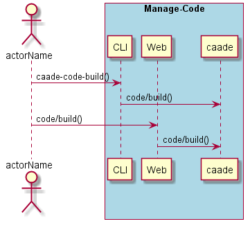
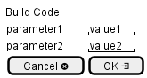

.. _Scenario-Build-Code:

Build Code
==========

Build Code using CLI and Web Interface with ... <parameters>

**CLI**

This is the command line interface for the Build Code Scenario.

.. code-block:: none

  # caade code build <parameters>
  # caade code build exmaple

**Web Interface**

This is a mock up of the Web Interface for the Build Code Scenario.

**REST**

This is the RESTful interface for the scenario.

*code/build*

============  ========  ===================
Name          Value     Description
------------  --------  -------------------
parameter1    value1    Description1
============  ========  ===================
