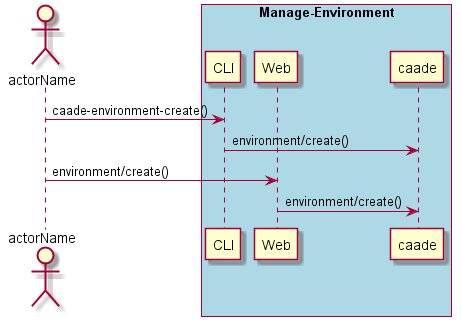
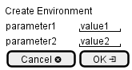

.. _Scenario-Create-Environment:

Create Environment
==================

Create Environment using CLI and Web Interface with ... <parameters>

**CLI**

This is the command line interface for the Create Environment Scenario.

.. code-block:: none

  # caade environment create <parameters>
  # caade environment create exmaple

**Web Interface**

This is a mock up of the Web Interface for the Create Environment Scenario.

**REST**

This is the RESTful interface for the scenario.

*environment/create*

============  ========  ===================
Name          Value     Description
------------  --------  -------------------
parameter1    value1    Description1
============  ========  ===================
